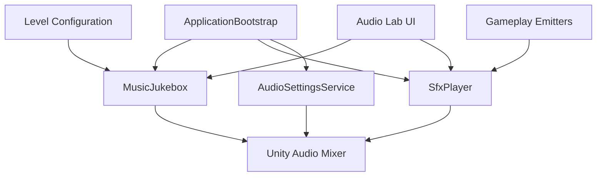

# Audio System Architecture

## Ownership

## Responsibility split

| Layer | Responsibility |
|---|---|
| Mixer settings | Saved Master, Music, SFX, and Ambience category levels |
| Track/cue assets | Individual content tuning and playback rules |
| Runtime players | Playback, fades, pooling, variation selection, and limits |
| Scene/gameplay components | Decide when a sound should be requested |
| Audio Lab | Browse, preview, tune, and diagnose; never owns playback |

## Music path

`LevelConfigurationData → LevelAudioCoordinator → MusicJukebox → Music AudioMixerGroup`

## SFX path

`Gameplay event or animation event → emitter/component → SfxPlayer → pooled AudioSource → SFX AudioMixerGroup`

## Gameplay call rule

- An animation event may play the **axe swing/whoosh**.
- Successful hit detection plays the **impact** at the collision position.
- `TakeDamage` or its damage event plays **hurt**.
- Death state entry plays **death** once.
- C4 detonation plays **explosion** at its world position.

## Reusability rule

Runtime services never contain fields named after Rescuers2D content. They accept reusable data assets. Game-specific components hold direct asset references in the Inspector.

## Playback-speed decision

Unity `AudioSource.pitch` changes both speed and pitch. The UI label should be **Playback Speed / Pitch**. True time stretching without pitch change is outside the initial scope.

## Reverse decision

Reverse playback is optional/experimental: use negative pitch and begin near the end of the clip. Validate it in editor, Windows, and WebGL. Failure on a target must not break ordinary playback.

